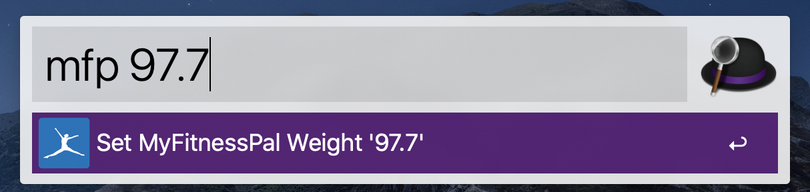

<h1>
   MFP Check-In Automator (Chrome plugin)
</h1>

## Motivation

Being the religious MyFitnessPal (MFP) user that I am it has always bothered me how slow and cumbersome the daily weight check-in is (whether it be on the MFP app or on the website).

Gaining access to MFP's API is not easy either as I've tried requesting access in the past with no success.

All of this was the motivation for the plugin you're now observing.

💭 The idea is very simple - when you enrich the `/measurements/check_in` MFP landing page with the query parameter `weight` and your corresponding weight value a custom JavaScript will automatically autofill
your value and saves it.

## Usage

Now that you know how the plugin works it's obvious that all you need to do is open a single web page in your browser - the check-in page with your weight appended. For example:

`https://www.myfitnesspal.com/measurements/check_in?weight=97.7`	

After opening the web page you'll see your weight automatically autofilled and the _Save Changes_ button clicked. Make sure to wait for the page to reload and see your weight updated.

I suggest automating the opening of the above page, for example by making aliases in your terminal or simply running the following command in your terminal:

`open https://www.myfitnesspal.com/measurements/check_in?weight=97.7`

This is still too slow for me so I prefer an [Alfred](https://www.alfredapp.com/) shortcut, like so:

✅ And with just a single keyboard shortcut and a few keystrokes I can finalize my daily check-in.

## Installation

The plugin is not available in the Chrome Web Store, but you can install it locally in just a matter of seconds by following [these quick steps](https://developer.chrome.com/extensions/getstarted#manifest).
